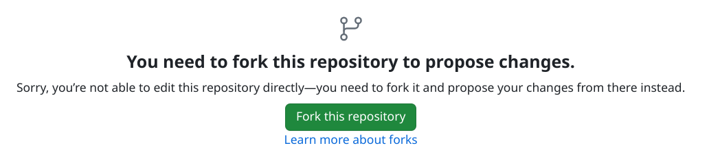
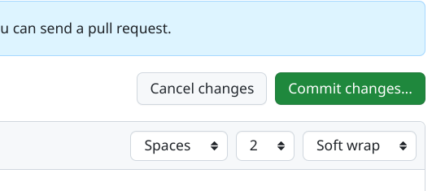
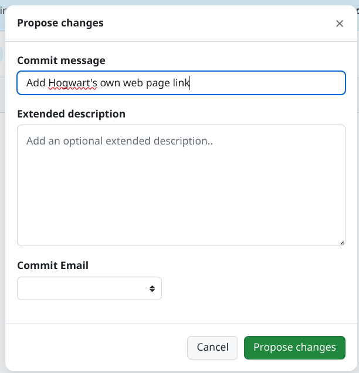

# Rules / Conduct.

See something you want to fix?  Here are the rules for contributing to this repository.

1. You should be someone cares that COVID-is-Airborne and the WHO should have advised the world of this in January 2020
2. Try to keep you summaries short.
3. Use the most authoritative/canonical article and date for the event

# What is GitHub?

Welcome to a bedrock of the software development industry. FOR US, GitHub is the portal WE use for editing and hosting 
of the generated website. Editing these TEXT entries of events requires you to first create an account on [GitHub.com](https://github.com/signup) 
and log into it. Contributions are placed in an area for review called "Pull Requests". Others will complete them from 
there. If so, your changes go live in about one minute after someone reviews then accepts your proposed changes. They 
may of course suggests changes on the comments on a "pull request" (see below). If they do, please consider any 
suggested actions. It could be they accept your contribution them immediately make small changes themselves - that's OK.

## Self setup for making changes on GitHub

First, Make an account on [GitHub.com](https://github.com). Please use a real name or something that passes for it: SamWilliams1234. 
**Pick 'free' option when it comes up rather that one of the monthly-fee options.**

You may want to ensure your email is protected from the history of the changes made:


# Making a change to a timeline entry (clicking the pen icon)

Find the entry you want to change, click the pen icon at the bottom of the text explanation of the entry/event:


Next, you'll see a page on GitHub that suggests you "fork" the repository that hold the site source code, and you'd click it to do so:

|                             | 
|:---------------------------------------------------------------------------------------:| 
| Screen cap of part of a GitHub page showing a "fork repo to change" button that's green |

Now, you're in the editor. You should be familiar with markdown at this stage, and the rules of THIS page. Make your 
changes

When you're ready, click "Commit changes" towards the top of the page on the right:

|                                   | 
|:--------------------------------------------------------------------------:| 
| Screen cap of part of a GitHub page showing a "button" button that's green |

You should pick a nice vert short communicative summary of the change you're trying to propose:

|                                            | 
|:----------------------------------------------------------------------------------------------:| 
| GitHub page screen cap showing a green "propose changes" button and a text dialog |


Then hit that green "Propose changes" button.

On the next "comparing changes" page hit the "create pull request" button - green on the right hand side

Finally, on a "Open a pull request" page, hit "create pull request" again - green and at the bottom of the page

Now the change you propose will be considered by the team maintaining the site. Watch out for emails - you might get 
pulled into a conversation on the change.

# Anatomy of a timeline text file

```
media_caption: a short description of the pic a person may be looking at, like dog on bicycle (optional)
media_credit: a list of people, or non-person entities like BBC media (optional)
media_link: <a url beginning https>
media_thumbnail: <a url beginning http> for to a tiny 16x16 pic of the event (optional)
media_url: <a url beginning https to the study, or article, or authoratative source>
start_date_day: day in month - (1 thru 31) - delete the whole line iof you don't know the day
start_date_month: month in year (1 thru 12)
start_date_year: year of event, like 2020
text_headline: short-ish description - it will be capitalized in the timeline, but not in the table of events.
text_text: much longer description of the even/study/article/video - has some additionals rules
```

These key:value lines are long. Don't insert carriage returns (newlines). If there are some for things you paste in, take them out.

You don't have to sweat the order of these key:values.  And optional ones can be blank if you wish

## Additional rules for the longer text

### Quote characters

This does not need a quote character like " for anying, but if you're quoting somebody or the text of an article you make like to do that: 

```
text_text: Dr Mike Ryan in a tearful press conference, "I have deep regret telling Dr Tedros to walk back the it's airborne comment on Feb 11th, 2020", before being led away by prosecutors.
```
(note Mike Ryan has not apologised for this real moment)

### Hyperlinks to secondary, tertiary online resources

```
text_text: Dr Mike Ryan apologized profusely in this tearful press conference for telling Dr Tedros to walk back his <a href='https://its-airborne.org/WHO#event-is-airborne-no-isnt-airborne'> it's airborne statement on Feb 11th, 2020</a> which was the subject of much doubling down in the last few years
```
Note: The link MUST be href='url' and not the more usual href=""
